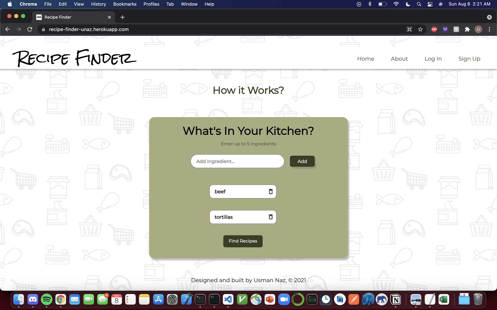
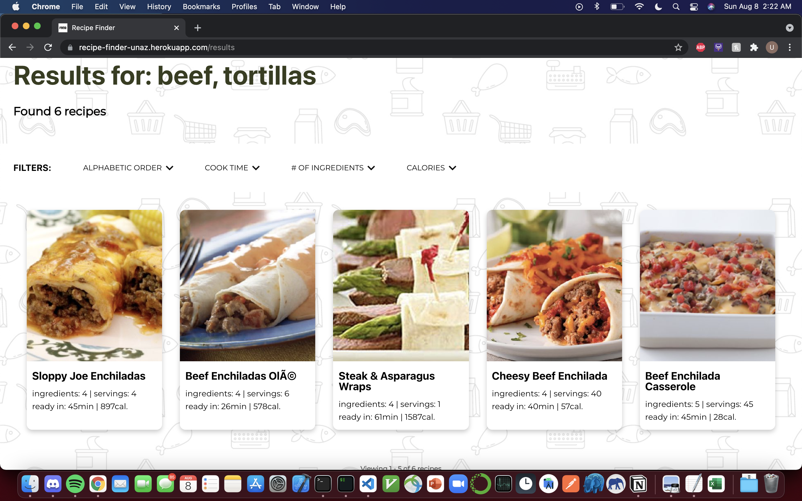
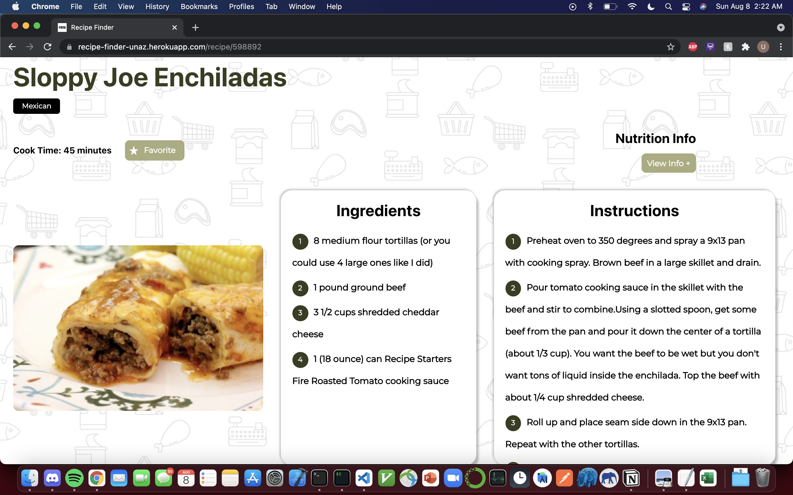
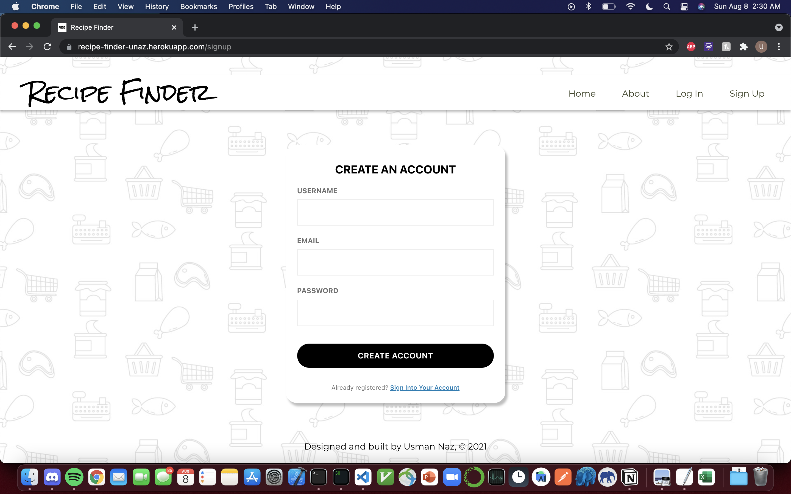
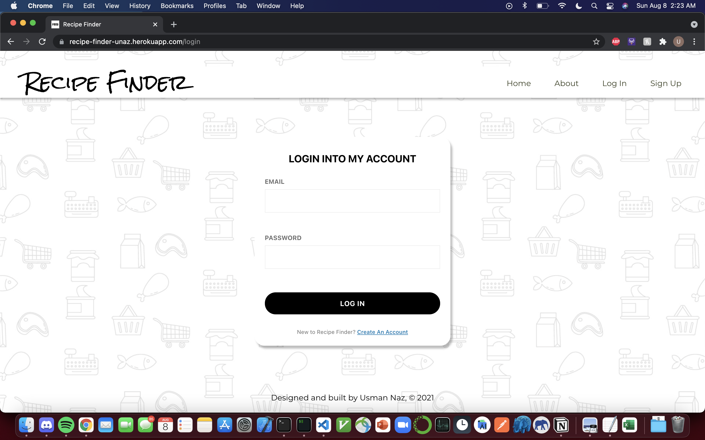
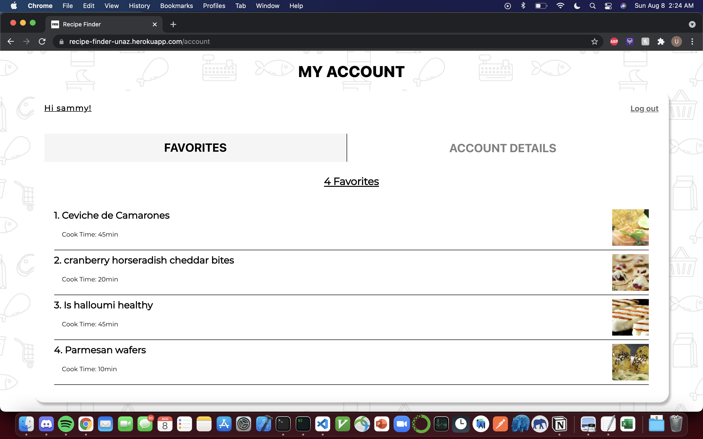
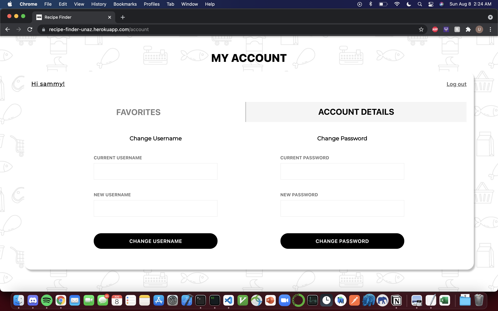
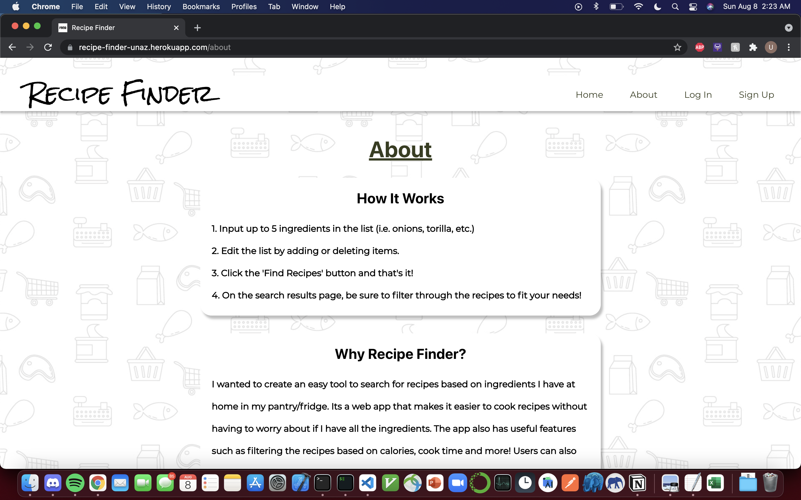

<!--
*** I'm using markdown "reference style" links for readability.
*** Reference links are enclosed in brackets [ ] instead of parentheses ( ).
*** See the bottom of this document for the declaration of the reference variables
*** for contributors-url, forks-url, etc. This is an optional, concise syntax you may use.
*** https://www.markdownguide.org/basic-syntax/#reference-style-links
-->

<!-- What my readme will consist of:
    1. Title
    2. link to website
    3. Table of Contents
    4. About the Project
        - motivation
        - technologies used
        - Design
    5. Getting started
        - prereqs
        - installation
    5. Features
    6. Usage (screenshots)
    7. Roadmap for Future
    8. License

 -->

 <!-- PROJECT LOGO -->

<br />
<p align="center">
  
  <h1 align="center">Recipe Finder</h1>

  <p align="center">
    An awesome web application to quickly find recipes based off available ingredients you have at home!
    <br />
    <a href="https://recipe-finder-unaz.herokuapp.com/"><strong>Explore the application »</strong></a>
    <br />
    <br />
  </p>
</p>

<!-- TABLE OF CONTENTS -->
<details open="open">
  <summary>Table of Contents</summary>
  <ol>
    <li>
      <a href="#about-the-project">About The Project</a>
      <ul>
        <li><a href="#motivation">Motivation</a></li>
        <li><a href="#design">Design</a></li>
        <li><a href="#built-with">Built With</a></li>
        <li><a href="#additional-technologies-used">Additional Technologies Used</a></li>
      </ul>
    </li>
    <li>
      <a href="#getting-started">Getting Started</a>
      <ul>
        <li><a href="#prerequisites">Prerequisites</a></li>
        <li><a href="#installation">Installation</a></li>
      </ul>
    </li>
    <li><a href="#features">Features</a></li>
    <li><a href="#usage">Usage</a></li>
    <li><a href="#roadmap-for-future">Roadmap For Future</a></li>
    <li><a href="#license">License</a></li>
  </ol>
</details>

<!-- ABOUT THE PROJECT -->

## About The Project

### Motivation

I love cooking. I have been cooking and trying out different recipes and cuisines since I was in elementary school. Since I am from a
traditional South Asian household, my mom cooks primary traditional desi foods. I always enjoyed other cuisines be it Chinese, Mexican,
Italian etc. In order to eat these types of foods, I had to learn to cook them on my own with the ingredients we had at home in the pantry,
fridge, etc. I primarily learned various recipes like cooking Chicken Alfredo, Fried Rice, authentic Mexican tacos and much more by searching the web for blogs and videos on how to cook.

My goal was to create an app that can make these recipes easily accessible by searching with a few ingredients I have at home and saving the recipes in one place while being able to try new recipes without having to constantly search through Google and Youtube.

In addition, it was an opportunity to learn full stack web development using PERN stack and gain meaningful experience working with popular technologies.

### Design

Designed mockups for both desktop and mobile versions of web app on Figma. [Click here](https://www.figma.com/file/k3iBzpR3W6rNquxtG1Tltu/Recipe-Finder?node-id=0%3A1) to view mockups.

### Built With

- [PostgreSQL](https://www.postgresql.org/)
- [Express.js](https://expressjs.com/)
- [React.js](https://reactjs.org/)
- [Node.js](https://nodejs.org/en/)
- [CSS](https://developer.mozilla.org/en-US/docs/Web/CSS)

### Additional Technologies Used:

- [Heroku](https://www.heroku.com/)
- [Formik](https://formik.org/)
- [Yup](https://github.com/jquense/yup)
- [Material-UI](https://material-ui.com/)
- [Figma](https://www.figma.com/)

Utilized the [Spoonacular Foof API](https://rapidapi.com/spoonacular/api/recipe-food-nutrition) to get recipe data.

<!-- GETTING STARTED -->

## Getting Started

To get a local copy up and running follow these simple example steps.

### Prerequisites

Need to have Node.js installed and configured on your local environment

### Installation

1. Clone the repo

   ```sh
   git clone https://github.com/usmanazz/Recipe-Finder.git
   ```

2. Delete the package-lock.json files in both the root and client directory.
3. Delete the node_module folders in root and client directory.
4. Install NPM packages in root and client directory
   ```sh
   npm install
   ```
5. In root, install necessary server dependencies
   ```sh
   npm install express cors pg bcrypt dotenv
   ```
6. For client side, see package.json file for list of dependencies
7. Run server from root directory
   ```sh
   node index.js
   ```
8. Run client on localhost
   ```sh
   cd client && npm start
   ```

<!-- FEATURES EXAMPLES -->

## Features

- Users can search recipes with up to 5 ingredients
- Users can filter through search results based on alphabetic order, number of ingredients, cook time, and calorie restrictions.
- Users can create an account and favorite recipes that can then be accessed in their account page.
- Users can change their username and password in the account page.
- Users can view nutrition information, dietary restrictions and cuisine types on the recipe page.
- Fully responsive web application using only CSS/JavaScript with the use of media queries, flexbox, grid, etc.
- Implemented pagination on search results page for a more fluid user experience

<!-- USAGE EXAMPLES -->

## Usage

### Home Page



### Results Page



### Recipe Page



### Sign up Page



### Log in Page



### Account Page showing User's Favorites



### Account Page showing Account Details tab



### About Page



<!-- ROADMAP -->

## Roadmap For Future

### Features to Add

- Add animations and transitions to various React Components for a more modern smooth UI
- Display user's name and user's email on 'Account Details' tab on acccount page
- Persist recipe data on recipe page
- Optimize website Accessibility
- Optimize website SEO

### Fixes/Code Maintenance

- Utilze React Context API to refactor and manage state rather than passing state as props
- Update database schema to normalize database, minimizing redundancy and establishing more meaningful relationships between entities
- Incorporate more robust fetch error handling
- Utilize Jest and other testing libraries to automate testing
- Update api routes to adhere standards for api naming conventions
- Store search results in database to minmize calls to Food api (reduce overage charges)

<!-- LICENSE -->

## License

Distributed under the MIT License. See `LICENSE` for more information.
